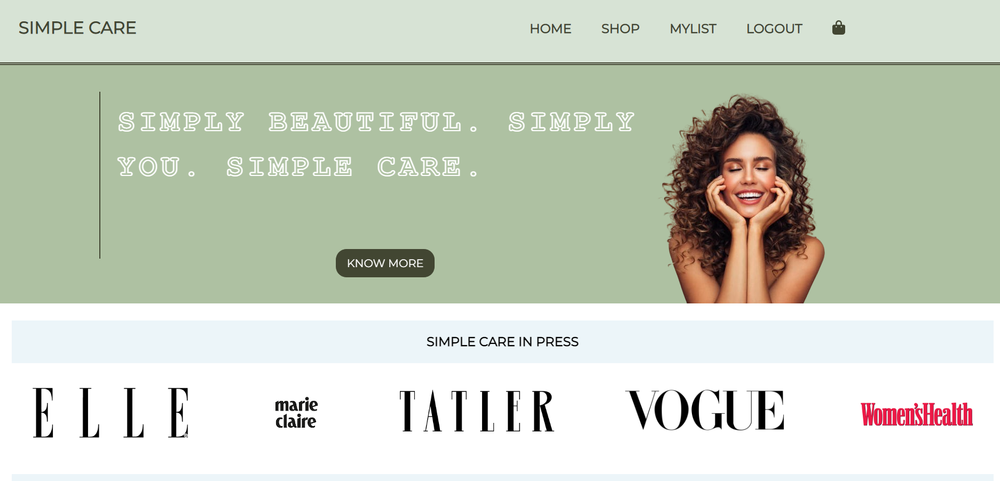
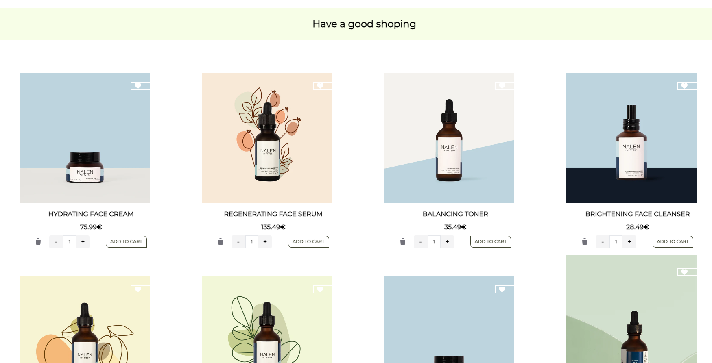
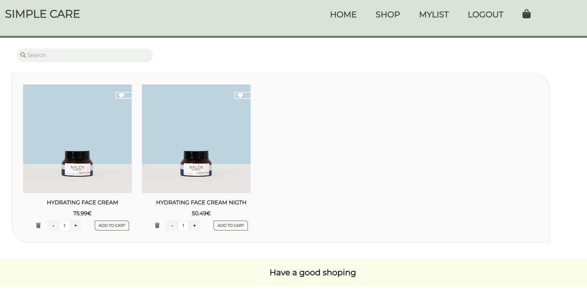
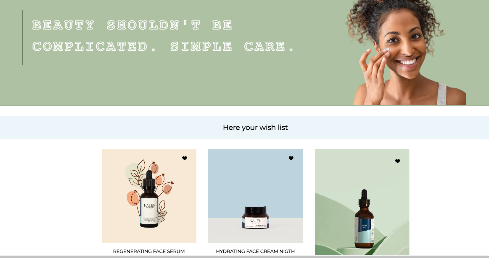
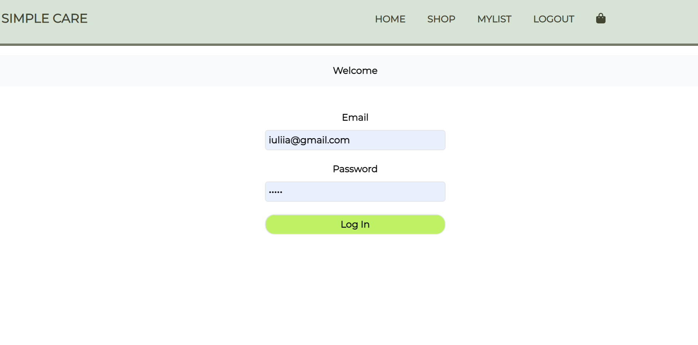
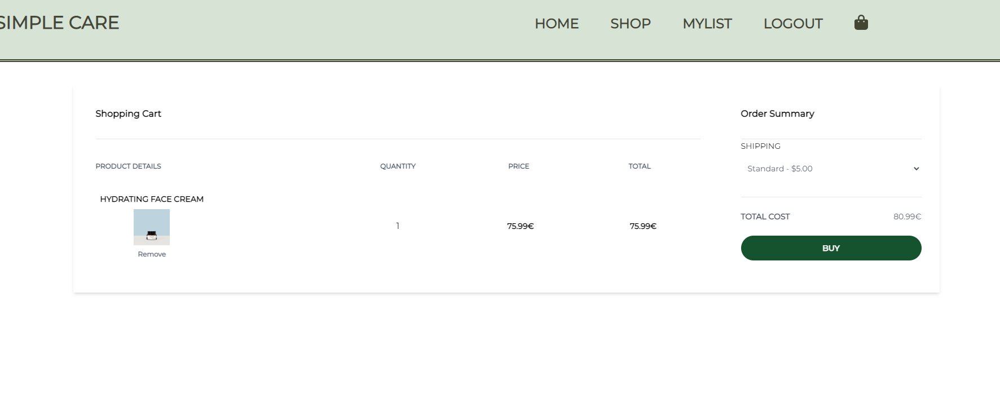
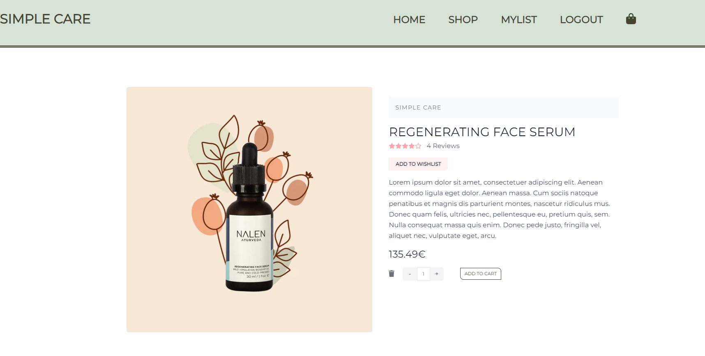

# About the Project

Hi everyone! This is a suggestion for the Assembler Institute of Technology. In this project, I've written a React app to run an online store without a database.

My main tasks were:
- Try to grasp the logic and visualization of components;
- Understand how to use the react hooks: useState, useEffect, useRef, useMemo, useReduce, and useContext;
- Understand how to use the react-router-dom hooks: useLocation, Navigate, BrowserRouter, Routes, and Route;

## Tecnologies

**For style:** CSS, Tailwind,
**For data:** JSON-server, localHost
**For developing:** JavaScript and React

## Setting to start

1. **How to run the project:** Open a terminal -> npm start (! make sure that you are in the correct folder "online-shop")
2. **How to run the json-server:** json-server --watch products.json

 ! Remember that you need to open two different terminals and get two servers, one for web and another for data.

 ## Visualization

 **Main page**
 

  **Shop page**
 

  **Search section**
 

 **Wish page**
 

 **Log page**
 

 **Cart page**
 

 **Product page**
 

## Functionality

So, what can we do on this web?

 **Main page**

 - If you click on the "Know more" button --> you will be redirected to the shop page.

 - In the "Best sellers" section: if you click on the "icon heart" --> the product will be added to your wishlist (just once, because it will check if you already have this product in wishlist or not), and this data will be saved in localhost.

 - In the "Best sellers" section: if you click on add to cart --> the product will be added to your cart. You can change the number of products you want to add. If you want to add the same product again, just the number of items will be changed.

  **Shop page**

- If you click on the "heart" --> the product will be added to wishlist (just once, because it will check if you already have this product in your wishlist or not), and this data will be saved in localhost.

 - If you click on add to cart --> the product will be added to cart, You can change the number of products you want to add. If you want to add the same product again, just the number of items will be changed. The data will be saved on localhost.

  **Search section**

 - Search input --> once you put in search terms and click enter, an additional modal will be opened and show us all matched items (even one letter will be taken into account).

 **Wish page**

 - If you click on the "heart" --> the product will be deleted from your wishlist and localhost.

 - If you click on add to cart --> the product will be added to your cart. You can change the number of products you want to add. If you want to add the same product again, just the number of items will be changed. The data will be saved on localhost.

 **Log page**

 - This shop has 2 private pages: MYLIST and CART. The user can add items from any page, BUT if he/she/they want to see them and modify --> he/she/they will be redirected to LOGIN/LOGOUT page. Once the user enters email (iuliia@gmail.com) and password (12345) he/she/they will get access to private pages. The data saved in localstorage

 !Important! As this project does not have a real database, logging in is just a simple verification of these state variables. Keep that in mind. You can see the code better here --> **/src/components/Login/Log.jsx"

- To log out, simply click the "LOGOUT" button in the header.This boton changes depend on whether the user is logged in or not.

 **Cart page**

- By clicking "Remove," the user can remove the product from the cart.
- User can choose shipping and the total price will be changed.

 **Product page**

 - If you click on the button "Add to wishlist" --> the product will be deleted from wishlist and localhost

 - If you click on add to cart --> the product will be added to your cart. You can change the number of products you want to add. If you want to add the same product again, just the number of items will be changed. The data will be saved on localhost

 - You can open product detail page make click on produtc img from HOME page or SHOP page

## Author

[Iuliia Shikhanova](https://github.com/IuliiaNova)